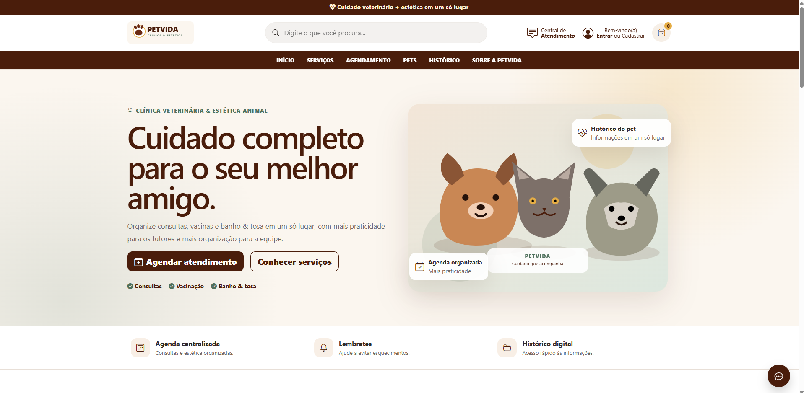
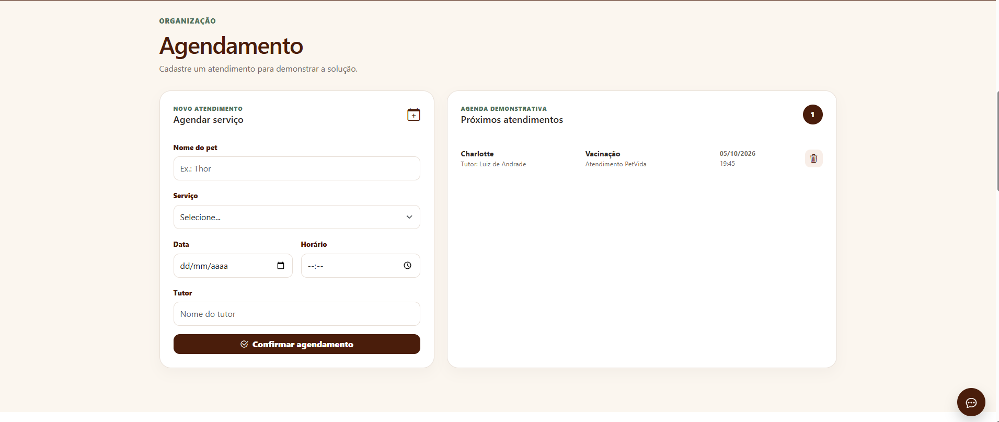
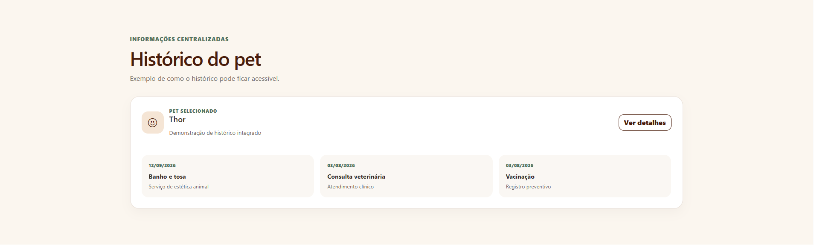

# PetVida — Clínica Veterinária & Estética Animal

Projeto acadêmico desenvolvido para a disciplina **Design Profissional**.

## Sobre o projeto

A PetVida utiliza atualmente telefone e agenda de papel para controlar seus atendimentos. Com o aumento da demanda, surgem conflitos de horários, esquecimentos, horários ociosos e dificuldade para localizar históricos médicos.

## Solução

Foi criado um **Web App responsivo** para centralizar serviços, agendamentos, pets e históricos em um único lugar.

A solução foi escolhida para reduzir os problemas causados pelo controle manual da clínica, facilitando a organização dos atendimentos e o acesso às informações dos pets.

## Funcionalidades

- Agendamento de atendimentos
- Consulta dos próximos agendamentos
- Prevenção de conflitos de horário
- Pesquisa de serviços
- Cadastro visual de pets
- Histórico do pet
- Login demonstrativo

## Tecnologias

HTML5, CSS3, Bootstrap 5.3.8, JavaScript e LocalStorage.

## Protótipos

### Página inicial

### Agendamento

### Histórico do pet

## Autor

**Luiz Feliphe Cordeiro de Andrade**
